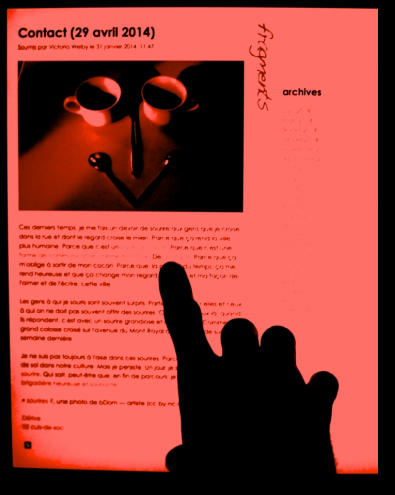

## La littérature numérique est-elle littéraire ?

Une brève introduction aux littératures numériques, dans laquelle on évoquera la difficulté de travailler sur des objets en mal de légitimation

===

Petite intro à un champ de la littérature que l'on qualifie d'émergent, la littérature numérique. L'occasion d'aborder les difficultés que l'on peut rencontrer lorsque l'on travaille sur un corpus un peu "atypique", ou lorsque l'on fait appel à des méthodologies en marge des études littéraires instituées.

Bref, lorsque l'on travaille sur un objet ou avec des objets dont la fameuse "Littérarité" n'a rien de tout à fait évident.

La littérature numérique est une bonne candidate pour mener cette réflexion épistémologique, car il s'agit d'un champ dit "émergent" qui, en vérité, ne finit pas d'émerger depuis plus d'un demi-siècle.

§§§§§§§§§§§§§§§§§§§§§§§§§§§§§§§§§§§§§§§§§§§§§
<!-- .slide: data-background-image="img/encreLienssubversifs.png" data-background-size="contain"-->

===

On peut effectivement parler de pratiques littéraires informatisées depuis les années 1950 au moins -- sans même arboder la question des pratiques littéraires pré-numériques, qui ont conçu des modèles textuels parfois abstraits, parfois incarnés dans le média livresque, et dont l'informatique va permettre d'exploiter tout le potentiel.

Je ne peux me permettre ici de développer une histoire de la littérature numérique, car pour être complet mon exposé devrait remonter, au moins, à la création de l'Encylopédie de D&A, qui fût l'un des premiers modèles hypertextuels français, notamment grâce à son système de renvois dit "subversif", cad des renvois entre des entrées de l'encyclopédie qui généraient un discours ironique ou critique -- une manière, à l'époque de détourner la censure, que l'on requalifierai aujourd'hui dans mon champ de recherche de dispositif interactif et performatif.

§§§§§§§§§§§§§§§§§§§§§§§§§§§§§§§§§§§§§§§§§§§§§
<!-- .slide: data-background-video="img/queneau.mp4" data-background-size="contain"-->

===

Je devrais également passer du temps sur les avant-gardes du début du XXe, les lettristes, Dada, la poésie concrète puis la poésie visuelle, mais également la poésie sonore qui, en leur qualité de  « commando littéraire de la langue » comme le propose Philippe Bootz, "ont profondément remis en question la conception traditionnelle du texte, la rendant compatible avec le multimédia".

Ici, les fameux *Cent Mille milliard de poèmes*, qui dans mon champ de recherche, prendrait le nom de générateur de texte ou de littérature combinatoire -- un lointain ancêtre de chatGPT, version paléolithique. Exemple très pratique pour expliquer à un néophyte le fonctionnement d'un algorithme ainsi que les notion informatique de syntaxe et de variable.

§§§§§§§§§§§§§§§§§§§§§§§§§§§§§§§§§§§§§§§§§§§§§
<!-- .slide: data-background-video="img/loveLetters.webm" data-background-size="contain"-->

===

Dans ses manifestations concrètement informatiques, la littérature numérique est quasi concomittante à la construction des premiers ordinateurs. Dès les années 1950, ainsi, nous assistons à la création des premiers générateurs de textes -- Lettres d'amour... vous voyez ici un émulateur = une reconstitution adaptée au web, en python.

Soit une pratique loin d'être jeune, mais qui pourtant peine à s'institutionnaliser. Cette lacune institutionnelle se traduit de différentes manières:
- la recherche scientifique sur cette littérature est encore assez confidentielle, pour ne pas dire qu'elle est balbutiante dans certains pays dont la France
- la littérature numérique est plutôt peu représentée dans les grands médias et dans les médias spécialisés (le matricule des Anges n'a pas encore de pages consacrées à la création numérique); j'attends encore le jour où l'on parlera de littérature générative au *Masque et la Plume* sur F. Inter.
- c'est également une littérature peu enseignée -- et par conséquence assez peu lue -- quoique : il vous est certainement arrivé au moins une fois de lire un travail relevant de la littérature numérique, mais sans nécessairement l'identifier.

Indice de ce manque de cette invisibilisation relative et de ce manque de légitimité, j'ai été frappée assez tôt, dans ma carrière, par la place que l'on m'accordait dans les programmes des colloques ou dans les sommaires des ouvrages collectifs consacrés à des thématiques littéraires transversales -- je veux dire ici des colloques ou des ouvrages qui ne portaient pas exclusivement sur la littérature numérique.

Je suis celle qui apparaît généralement tout à la fin (sorte de logique téléologique ou chronologique), voire tout au début, mais en tout cas à la marge, à la limite du texte et du programme. Cela fait maintenant presque 15 ans que je suis supposée représenter une "avant-garde" novatrice, une littérature "exploratoire", sans que jamais ni mon corpus ni moi-même ne parvenions à réintégrer le cours "normal" de l'histoire littéraire.

Noeud de mon problème : le qualificatif "numérique", qui cristalise l'attention et surtout détourne l'attention du texte pour le tourner entièrement vers le dispositif, numérique donc, lequel fait par ailleurs l'objet d'une compréhension parfois approximative, contridictoire, biaisée.

§§§§§§§§§§§§§§§§§§§§§§§§§§§§§§§§§§§§§§§§§§§§§

>"La légitimation s’invite au rang des questions épineuses, dans le quotidien même des écrivains contemporains. Elle s’impose dans le même temps aux écranvains, fréquemment accusés de privilégier le support Internet, car permettant une autoédition synonyme de désintermédiation, c’est-à-dire de stratégie d’évitement des filtres traditionnels mis en place par la chaîne du livre. Pas une discussion au sujet des blogs qui n’interroge in fine, et parfois avec virulence, la littérarité problématique de leurs contenus."

>Gilles Bonnet, *Pour une poétique numérique*, 2017.

<!-- .element: style="font-size:1.6rem" -->

===

J'aborde un champ littéraire encore mal légitimé pour plusieurs raisons. Tout d’abord, les oeuvres que j'étude relèvent souvent de l’ultra-contemporain : les projets sont souvent en cours ou tout juste publiés. Mais surtout, elles existent hors du media livresque, c’est-à-dire hors du cadre traditionnel de la publication dont on connait la fonction légitimante : l’objet livre endosse immédiatement l’aura de son éditeur que ce soit chez un grand éditeur ou au contraire au sein d’une petite maison d’édition expérimentant des auteurs et des formes. Ces œuvres pénètrent presque automatiquement les portes des institutions patrimoniales (on pense au dépôt légal), mais aussi plus facilement les portes de l’institution académique. Le cercle de la légitimation est bouclé.

Au contraire, mes auteurs empruntent des chemins détournés, souvent à dessein, dans un but d’exploration de formes inédites, d’espaces en friche. En choisissant de s’écrire et de se rendre publics hors les livres, ces auteurs cherchent certes une forme d’émancipation, mais échappent également à cette triple légitimation: celle de l’éditeur, de l’institution patrimoniale et de l’institution académique.

§§§§§§§§§§§§§§§§§§§§§§§§§§§§§§§§§§§§§§§§§§§§§

>"La littérature, c’est la littérature, ce que les autorités (les professeurs, les éditeurs) incluent dans la littérature. Ses limites bougent parfois, lentement, modérément [...], mais il est impossible de passer de son extension à sa compréhension, du canon à l’essence." 

>Antoine Compagnon, "La littérature, pour quoi faire ?", 2013.

<!-- .element: style="font-size:1.6rem" -->

===

Pendant un certain temps, j'ai trouvé une issue à mon problème en la personne d'A. Compagnon.

>La littérature, c’est la littérature, ce que les autorités (les professeurs, les éditeurs) incluent dans la littérature. Ses limites bougent parfois, lentement, modérément [...], mais il est impossible de passer de son extension à sa compréhension, du canon à l’essence. 

Mais je ne suis pas Antoine Compagnon.

Aussi, il m'a fallu retravailler mes concepts, et me situer par rapport à des définitions historiques de la littérature, parfois tellement ancrées dans nos études littéraires qu'elles sont devenues des impensés :
- l'auteur
- l'oeuvre
- le corps
- le livre

C'est en cela qu'un objet d'étude difficile à légitimé est sans doute le plus intéressant: il engage un travail épistémologique particulièrement poussé, et change notre rapport à une discipline.
C'est ce parcours que je vais retracer en partie avec vous aujourd'hui

§§§§§§§§§§§§§§§§§§§§§§§§§§§§§§§§§§§§§§§§§§§§§

### Extension du domaine de la littérature : vers une étude du *fait littéraire* numérique

===

la première étape de mon parcours consiste à préciser les contours de ce que l’on entend par « littérature » et, à plus forte raison peut-être, ce que l’on range dans le domaine des « études littéraires ». Le point de vue d’Antoine Compagnon, cité plus tôt, démontre bien que le nœud du problème est d’abord et avant tout institutionnel. 

À plusieurs niveaux, j'ai cherché à prôner l’ouverture, à la fois celle du « fait littéraire » et de son étude. 

Le choix même de l’expression « fait littéraire » renvoie pour moi à une volonté de comprendre la diversité des productions littéraires de manière transversale – en articulant des questions aussi bien stylistiques que médiatiques, sémiotiques, techniques, sociologiques, économiques, etc. Pour le dire autrement, il s’agit donc de prendre en compte l’énonciation éditoriale des objets littéraires, et plus spécifiquement leur énonciation médiatique.

Cela tombait plutôt bien, car pendant mes années de doctorat et de post-doctorat, j'ai travaillé à l'UdeM au sein d'un département marqué par l'empreinte des *media studies* et du chercheur candadien Marshall McLuhan.

§§§§§§§§§§§§§§§§§§§§§§§§§§§§§§§§§§§§§§§§§§§§§

### De la littérature transitive à la littérature dispositive

===

Cette première ouverture de la littérature, requalifiée en "fait littéraire", invite à prendre le parti théorique et méthodologique des chercheur.e.s qui font preuve d’une sensibilité plus marquée aux différentes conditions d’existence et de production des textes (selon des perspectives tour à tour sociologiques, médiatiques, sémiotiques, etc.), contre les tenants d’une approche immanente des corpus (focalisée sur le texte). 

Évidemment, cette opposition est quelque peu caricaturale : dans l’histoire de la critique littéraire, la ligne de partage est loin d’être aussi nette.

Ce qui importe, surtout, c’est de tenir compte de l’influence notable exercée par l’héritage formaliste puis post-structuraliste dans les études littéraires, où l’on note une tendance à la sur-valorisation du texte (pour ne pas dire son essentialisation), jusque dans la définition même de la littérature et l’exercice de la discipline. Et si l’on plaide de plus en plus pour une conception transitive du fait littéraire, ce dernier demeure bien souvent cloisonné dans le domaine du langage, soit du travail de la langue et du style, indépendamment de ses conditions matérielles (mais aussi institutionnelles, par exemple). 

§§§§§§§§§§§§§§§§§§§§§§§§§§§§§§§§§§§§§§§§§§§§§
<!-- .slide: data-background-video="img/poemm.mp4" data-background-size="contain"-->

===

De ce point de vue, la littérature numérique joue un rôle essentiel dans ce que l'on a pu qualifier de "Tournant médiatique" des études littéraires, qui s'intéresse aux effets de sens produits par l'environnement support des oeuvres littéraires. La matérialité du texte, et les effets de sens produits par cette matérialité, dont partie intégrante des poétiques numériques -- comme on le voit ici avec un exemple de poésie tactile, adaptation du principe du calligramme adapté au potentialités techniques et interactives de l'écran tactile.

On peut ici dresser un parallèle avec l'ensemble de la littérature contemporaine qui se caractérise en effet par l’investissement massif de formes médiatiques situées « hors livre » : littérature exposée ou performée dans l’espace public (Nachtergael 2018; Ruffel 2016), littérature électronique ou hypermédiatique publiée sur des blogues ou sur des applications dédiées (Flores 2019; Bouchardon 2014; Saemmer 2007), ou encore littérature profilaire – “twittérature”, “littéraTube”. Le “moment contemporain” de la littérature explore ainsi des environnements-supports qui encouragent les études littéraires à se déplacer du côté des *media studies* -- qu'elles ont d'ailleurs largement contribué à constituer.

Sauf que dans le champ de la littérature numérique, cette dimension médiatique et plus particulièrement technique, est devenu un critère définitoire essentiel, ce qui n'est pas sans poser problème.

§§§§§§§§§§§§§§§§§§§§§§§§§§§§§§§§§§§§§§§§§§§§§

>"In the contemporary era, both print and electronic texts are deeply interpenetrated by code. Digital technologies are now so thoroughly integrated with commercial printing processes that print is more properly considered a particular output form of electronic text than an entirely separate medium. Nevertheless, electronic text remains distinct from print in that it literally cannot be accessed until it is performed by properly executed code. The immediacy of code to the text's performance is fundamental to understanding electronic literature, especially to appreciating its specificity as a literary and technical production. Major genres in the canon of electronic literature emerge not only from different ways in which the user experiences them but also from the structure and specificity of the underlying code. Not surprisingly, then, some genres have come to be known by the software used to create and perform them."

> Katherine Hayles, « Electronic literature: What is it? », 2007

<!-- .element: style="font-size:1.6rem" -->

=== 

Dans un texte théorique fondateur du champ des études hypermédiatiques, la chercheuse américaine Katherine Hayles, fondatrice des études en littérature électronique, définit d'ailleurs celle-ci par sa capacité à être performée par la machine :

>À l'époque contemporaine, les textes imprimés et électroniques sont profondément interpénétrés par le code. Les technologies numériques sont aujourd'hui tellement intégrées aux processus d'impression commerciale que l'imprimé est davantage considéré comme une forme de sortie particulière du texte électronique que comme un support entièrement distinct. Néanmoins, le texte électronique reste distinct de l'imprimé en ce sens qu'il est littéralement inaccessible tant qu'il n'est pas exécuté par un code adéquat. L'immédiateté du code par rapport à la performance du texte est fondamentale pour comprendre la littérature électronique, en particulier pour apprécier sa spécificité en tant que production littéraire et technique. 

[Les principaux genres dans le canon de la littérature électronique émergent non seulement des différentes façons dont l'utilisateur les expérimente, mais aussi de la structure et de la spécificité du code sous-jacent. Il n'est donc pas surprenant que certains genres soient connus par le logiciel utilisé pour les créer et les interpréter].

§§§§§§§§§§§§§§§§§§§§§§§§§§§§§§§§§§§§§§§§§§§§§
<!-- .slide: data-background-image="img/fightOfTheCodeMonkeys.png" data-background-size="contain"-->

===

CF. exemple de Mark Marino : on est dans une oeuvre computable, cad dont la lecture est conditionnelle à l'exécution d'un programme, dans lequel en l'occurence le lecteur est amené à jouer un rôle : c'est lui qui exécute le programme dont il est d'ailleurs invité à modifier des variables.

Mark Marino est l'un des plus grands représentants d'un courant théorique et critique que l'on appelle les *critical code studies* : études critiques du code, qui consistent en une application de l'herméneutique critique à l'interprétation du code informatique, de l'architecture des programmes et de la documentation dans un contexte socio-historique.

Ces définitions ont un impact majeur sur la définition de la littérature numérique, qui va de fait être très restricitive :

- Une oeuvre de littérature électronique, c'est une oeuvre qui doit nécessairement être performée sur un ordinateur 
- C'est une oeuvre qui a été codée, le code étant conçu alors comme une écriture poétique.  
- L'écrivain numérique doit être alors un codeur, et ses compétences informatiques jouent un rôle essentiel dans l'évaluation de la valeur de l'oeuvre

§§§§§§§§§§§§§§§§§§§§§§§§§§§§§§§§§§§§§§§§§§§§§

>"On peut également les examiner sous l’angle du dispositif de communication et regarder les nouvelles situations de communication que proposent ces productions. Cet aspect est particulièrement instructif car la spécificité fondamentale de la littérature informatique ne réside pas dans son caractère écranique ou multimédia, caractère que la vidéo ou l’opéra ont exploré par ailleurs, mais dans la singularité du dispositif de création / lecture qu’elle instaure. Poser la question sous cet angle revient à soupçonner un déplacement de la question littéraire. Partant d’un questionnement structuraliste sur les formes que prendrait un objet dénommé texte, la littérature, dans une optique de littérature du dispositif, aurait évolué dans une dimension systémique."

>Phlippe Bootz, « La littérature déplacée », 2006

<!-- .element: style="font-size:1.6rem" -->

====

Ainsi, dans les premières définitions de la littérature électronique, l’attention se concentre principalement sur la dimension dispositive des objets littéraires. Une telle approche ne se départit pas toujours de l’influence formaliste, tel qu’on le note avec Philippe Bootz, qui souligne déplacement « d’une littérarité structurelle textuelle à une littérarité liée au dispositif de communication » :

>On peut également les examiner sous l’angle du dispositif de communication et regarder les nouvelles situations de communication que proposent ces productions. Cet aspect est particulièrement instructif car la spécificité fondamentale de la littérature informatique ne réside pas dans son caractère écranique ou multimédia, caractère que la vidéo ou l’opéra ont exploré par ailleurs, mais dans la singularité du dispositif de création / lecture qu’elle instaure. Poser la question sous cet angle revient à soupçonner un déplacement de la question littéraire. Partant d’un questionnement structuraliste sur les formes que prendrait un objet dénommé texte, la littérature, dans une optique de littérature du dispositif, aurait évolué dans une dimension systémique.

§§§§§§§§§§§§§§§§§§§§§§§§§§§§§§§§§§§§§§§§§§§§§
<!-- .slide: data-background-image="img/commeSideRienNetait.png" data-background-size="contain"-->

===

Exemple de l'hypertexte "comme si de rien n'était".

§§§§§§§§§§§§§§§§§§§§§§§§§§§§§§§§§§§§§§§§§§§§§

### La *e-lit*, une littérature élitiste ?

===

Tout en se réclamant d’une définition dispositive de la littérature numérique, cette conception a paradoxalement eu tendance à transférer le discours du texte vers le code, au risque d’instituer un autre formalisme, notamment incarné par l'approche en *critical code studies*.

À force de vouloir démontrer l'originalité de la littérature électronique, les chercheurs l'ont enfermée dans un champ très restreint, sans pouvoir toujours s'adapter aux développement technologique numérique lui-même -- en particulier celui des plateformes, à partir de ce que l'on appelle communément le web 2.0.

Ajoutons à cela une critique qui, au sein même de la communauté savante, ne manque pas d'animer les congrès de notre association: la plupart des grands auteurs de la littérature électronique sont aussi des chercheurs -- qui l'étudient, qui la définissent, et qui la lisent. 
Et il faut bien reconnaître l'aridité de certaines oeuvres, où le lecteur est, dans le meilleur des cas, invité à profiter d'une expérience esthétique conceptuelle, au pire, à devoir lui-même lire le code et mettre les mains dans le cambouis pour profiter pleinement de son expérience de "lecture".

Il n'y a qu'un pas pour qualifier La littérature électronique d'élististe, alors même qu'elle est sur le point de faire face à une vague populaire venue des développements du web participatif.

§§§§§§§§§§§§§§§§§§§§§§§§§§§§§§§§§§§§§§§§§§§§§

>"En rejoignant les thèses de Dylan Kinnett et de Paul LaFarge, Gefen affirme qu’il n’est pas possible de définir la littérature numérique en opposition au reste de la littérature, mais qu’il faut plutôt la comprendre en l’insérant dans la continuité des pratiques littéraires. Dans ce sens, plutôt que de parler de « littérature numérique », en mettant l’accent sur les outils technologiques utilisés pour la production et la réception des œuvres littéraires, il faut parler de « littérature à l’époque du numérique »." 

>Marcello Vitali-Rosati, *Qu'est-ce que la littérature numérique*, 2016.

<!-- .element: style="font-size:1.6rem" -->

===

Dans un récent article, Marcello Vitali-Rosati a d’ailleurs bien montré le problème posé par ces premières définitions de la littérature électronique qui fonctionnent d’abord par exclusion. Il plaide ainsi pour une ouverture de la littérature « électronique », qui doit déjà être requalifiée en littérature « numérique », et même réintégrée à la « littérature » dans son ensemble :

CITER

Cette dernière proposition me permet en fait de mieux mettre le doigt sur mon problème, et de reposer la question : car le pb n'est pas tant de savoir si la littérature numérique est littéraire, mais si elle est bel et bien "numérique" -- dans la mesure où ce que l'on range sous ce terme "numérique" n'est pas si évident.

§§§§§§§§§§§§§§§§§§§§§§§§§§§§§§§§§§§§§§§§§§§§§

### La littérature numérique est-elle  (et doit-elle être)  numérique ?

===

Au tournant des années 2000, l'avènement du Web 2.0 va se traduire par diffusion massive du fait numérique auprès du public, sous l'effet conjugué d'une meilleure accessibilité aux appareils (moins coûteux, plus compacts et conçus pour un usage individuel), au Web (plus grande couverture, moins chère et plus rapide), ainsi qu'aux outils de publication (grâce à l'émergence des CMS et des réseaux sociaux requérant des compétences techniques minimales). Cette diffusion marque véritablement un basculement vers une *culture* numérique à part entière qui, au-delà des phénomènes techniques, renvoie à tout un ensemble de mutations conceptuelles. Dans le champ de la littérature électronique, où la littérarité est généralement consubstantielle aux compétences informatiques de l'auteur, le développement des plateformes d'écriture pose question.

§§§§§§§§§§§§§§§§§§§§§§§§§§§§§§§§§§§§§§§§§§§§§
<!-- .slide: data-background-image="img/wattpad.png" data-background-size="contain"-->

===

Quel crédit accorder à ces travaux conçus à partir de ces plateformes populaires qui, à l'instar de WattPad, ont construit leur discours promotionnel autour d'un idéal d'émancipation des compétences informatiques ("Don't think, just write") ? Que penser par ailleurs des écritures littéraires destinées aux réseaux sociaux (Twitter, Youtube...) dont la fonction première n'est même pas littéraire ? 

Enfin, comment ne pas nous méfier d'un effet de plateformisation dénoncé bien au-delà de la sphère littéraire, et que l'on pourrait presque considérer comme un nouveau monopole éditorial cette fois-ci dirigé par les fameux GAFAM, alors même que certaines plateformes ont d'ores et déjà donné leur nom à des formes d'écriture littéraire -- *twitterature*, *littéraTube*, *auto-blographie* ?

§§§§§§§§§§§§§§§§§§§§§§§§§§§§§§§§§§§§§§§§§§§§§
<!-- .slide: data-background-image="img/lovecraftBot.png" data-background-size="contain"-->

===

Le spécialiste de la littérature électronique Leonardo Flores parle ainsi d'une troisième vague / génération de littérature électronique, qui investit des espace de publication jugés plus populaires, de manière à gagner de nouveaux publics.
Flores a bien conscience que se joue ici un pb majeur par rapport à la définition canonique du champ littéraire numérique. Aussi, pour lui, la littérature électronique de 3e génération conserve un caratère computationnel très fort. Son exemple clé est le BOT (le robot), qui va générer du texte et le publier sur un réseau social.

Dans l'exemplier : un bot qui génère des scénarios inspirés de l'univers de Lovecraft. 

Un bot qui reconnaît dans le flux Twitter tous les tweets dont la forme correspond à un pentamètre, et qui les re-publie dans un son fil, de manière à créer un sorte de poème continu.

§§§§§§§§§§§§§§§§§§§§§§§§§§§§§§§§§§§§§§§§§§§§§

<iframe width="560" height="315" src="https://www.youtube.com/embed/KKanP1OQS5A" title="YouTube video player" frameborder="0" allow="accelerometer; autoplay; clipboard-write; encrypted-media; gyroscope; picture-in-picture; web-share" allowfullscreen></iframe>

===

Mais également des objets plus farfelus : une conversation entre un chat et son propriétaire, réalisée à l'aide d'un logiciel qui mime l'interface d'une messagerie de téléphone.

Il faut comprendre que, pour les tenant des premières génération de littérature électronique, des BOT de chats (littéralisation ironique et potache de l'expression *chat bot*) qui tweetent des poèmes, ne font pas toujours le meilleurs effet.

En 2018, lors du congrès ELO où Flores a présenté sa théorie des 3 générations de elit, et à laquelle j'ai eu l'occasion de participer pour présenter moi-même des formes de littérature numériques non-exécutables et arrimées aux réseaux sociaux, les débats ont été houleux.

la 3e génération ne fait pas concensus. 

Ce phénomène, s'il marque une évolution des pratiques littéraires, suggère une analyse différente de celle qui a présidé aux fondements de la Elit. En effet, ces nouvelles pratiques littéraires ne font le plus souvent aucun usage du code ou de la programmation.

§§§§§§§§§§§§§§§§§§§§§§§§§§§§§§§§§§§§§§§§§§§§§
<!-- .slide: data-background-image="img/literaTube.png" data-background-size="contain"-->

===

Pour certains, il n'y a qu'un pas pour affirmer que la dernière génération de littérature électronique est une génération d'écrivains analphabètes -- car ne maîtrisant pas le code. Mais peut-on dire pour autant que ces nouveaux écrivains n'ont pas la maîtrise du fait numérique, uniquement parce qu'ils n'ont pas la maîtrise du code ?

La littéraTube -- souvent de la poésie filmée et mise en images, comme ici dans un exemple récent de Gracia Bejjani -- est sans aucun doute beaucoup plus accessible au lecteur qu'une oeuvre générative.

§§§§§§§§§§§§§§§§§§§§§§§§§§§§§§§§§§§§§§§§§§§§§

<iframe width="560" height="315" src="https://www.youtube.com/embed/4TObl7W9OAA" title="YouTube video player" frameborder="0" allow="accelerometer; autoplay; clipboard-write; encrypted-media; gyroscope; picture-in-picture; web-share" allowfullscreen></iframe>

===

Il apparaît alors que l'abandon de la technique de programmation ne se conjugue pas avec un renoncement esthétique, mais plutôt avec un déplacement de la littérarité, qui se traduit parfois par un véritable retour à des formes poétiques plus traditionnelles, voire par un retour au format imprimé.

L'outil numérique n'est plus tant utilisé pour produire un texte computable, mais pour ouvrir un espace de publication et de liberté, en marge (et parfois en opposition) à un écosystème éditorial où il ne se sentent pas très bien accueillis.

Le critère numérique, en tous les cas, ne doit plus être le seul signe de littératité. Dans un colloque que je coorganisais il y a quelques années, et qui portait le titre original "L'écrivain à l'ère du numérique", l'écrivain Thierry Crouzet s'était ainsi emporté :

>"Est-ce qu’au XIXe siècle il y avait des colloques sur l’auteur à l’ère de la plume d’oie taillée, ou des colloques sur l’auteur à l’ère de la plume Sergent-Major (1856) ou de la machine à écrire (1872) ? Personne n’a eu cette idée saugrenue. Parler des auteurs à l’ère numérique, d’auteurs numériques ou de littérature numérique nous enferme, nous étouffe, nous arrache au champ de la littérature. Nous nous en excluons nous-mêmes, et pour cause nous ne nous mélangeons presque jamais à ceux qui ne sont pas de notre paroisse."

Là où les deux premières générations d'écrivains "numériques" ont défini une littérarité numérique à partir de critères essentiellement informatiques (l'écriture du code et la programmation des oeuvres), une nouvelle génération esquisse une autre forme de littérarité qui repose sur ce que l'on appelle communément aujourd'hui la littératie numérique.

À travers ce terme de "littératie numérique", il s'agit de désigner une compétence numérique qui se distingue de la compétence informatique, pour s'attacher à la compréhension des enjeux théoriques, politiques, philosophiques et épistémiques du fait numérique.

Ce qui se joue alors, notamment, c'est la capacité de jouer avec les formes culturelles de ces plateformes et avec leurs algorithmes de recommandation. Fondamentalement sociales, ces plateformes requièrent de la part de ces « écranvains » la maîtrise de ces nouvelles sociabilités numériques, dont on comprend non seulement les dynamiques légitimantes, mais aussi les effets performatifs sur l'écriture et donc sur le texte lui-même.

§§§§§§§§§§§§§§§§§§§§§§§§§§§§§§§§§§§§§§§§§§§§§
<!-- .slide: data-background-image="img/AccidentPersonneVissac1.png" data-background-size="contain"-->

===

Ainsi, en twittérature (littérature écrite et publiée sur et pour Twitter), on observe une pratique d'écriture plus classique que dans les dispositifs génératif, mais néanmoins outillée, au plus près des formes et des pratiques de la plateforme, dont il s'agit en partie de détourner l'usage. 

C'est là tout l'intérêt, d'ailleurs, d'une littérature des plateformes : telle un cheval de Troie, ou dans la tradition des *tactical media*, elle vient réfléchir les usages prescrits par la plateforme et proposer des pratiques alternatives, encourageant ainsi une réflexion critique sur les nouveaux modes de communication contemporains, et sur notre culture médiatique contemporaine. Cette twittérature s'inscrit par ailleurs dans la continuité formelle et générique avec des genres littéraires qui débordent la e-lit (sur un plan poétique, la concision de Twitter en appelle à la pratique du haiku, de l'aphorisme, de l'épigramme; également, parce que la plateforme est le lieu par excellence de la construction profilaire, twitter offre un espace inédit au récit de soi ; enfin, parce qu'il relève de la pratique du micro-blogging, il rappelle également le feuilleton et donne lieu à des fictions fragmentées). 

L'exemple que l'on prendra ici est celui de l'oeuvre *Accident de personne* de Guillaume Vissac.

§§§§§§§§§§§§§§§§§§§§§§§§§§§§§§§§§§§§§§§§§§§§§
<!-- .slide: data-background-image="img/" data-background-size="contain"-->

>"Pendant presque deux ans, je passais entre deux et trois heures par jour en transport en commun (RER, métros). Tout ce temps-là, mis bout à bout, ça fout la lourde comme on dit par chez moi, le vertige. J’ai donc eu mon compte d’accidents de personne, je ne les ai pas comptés, mais toujours une atmosphère particulière dans le wagon lorsque le conducteur l’annonce, ou sur les quais quand les écrans clignotent. Un jour l’un d’entre eux m’a fait arriver deux heures en retard dans mon boulot de l’époque. Ce jour-là, l’idée d’en faire quelque chose, de prendre des notes, et l’écriture de la toute première."

>Guillaume Vissac, *Accident de personne* (version e-pub)

<!-- .element: style="font-size:1.6rem" -->

§§§§§§§§§§§§§§§§§§§§§§§§§§§§§§§§§§§§§§§§§§§§§
<!-- .slide: data-background-image="img/" data-background-size="contain"-->

>"La prise de notes a duré un an et demi. Toutes ces notes (ou la plupart) ont été écrites directement embarqué soit dans les wagons, soit sur les quais, au téléphone portable classique, ensuite via l’iPhone. [\...] Fin 2010, j’avais plus de 200 fragments d’écrits, tous de moins de 140 caractères, alors j’ai créé le compte @apersonne, j’ai épuré mon texte. J’en ai gardé environ 160. De cette façon, j’ai pu mettre en ligne 5 fragments par jour pendant un mois tout juste. C’était novembre, j’ai choisi décembre, et ça tombait bien avec Noël et réveillon à la fin comme acmé. L’idée était là depuis le tout début, de pouvoir programmer les twitts à heure fixe, tous les jours 7h, 9h, 12h, 18h et 20h, afin que les twitts puissent être lus aux heures de pointe, dans les transports précisément. Et puis ça avait un côté feuilleton : les followers ont commencé à savoir que c’était « bientôt l’heure d’@apersonne »."

>Guillaume Vissac, *Accident de personne* (version e-pub)

<!-- .element: style="font-size:1.6rem" -->

===

§§§§§§§§§§§§§§§§§§§§§§§§§§§§§§§§§§§§§§§§§§§§§
<!-- .slide: data-background-image="img/AccidentPersonneVissac3.png" data-background-size="contain"-->

===

La genèse de l'oeuvre montre un travail qui s'est construit autour du fonctionnement de la plateforme Twitter : un réseau informationnel, où l'auteur va proposer un détournement de l'annonce sonore également connue aujourd'hui sous le nom d'"info-traffic", en donnant la parole aux victimes fictives de ces accidents de personne. Il s'agit également de travailler la forme courte, qui n'est pas sans rappeler l'épigramme funéraire, en adoptant la contrainte du réseau (à l'époque, 1 tweet pour 140 caractères). Mais il s'agit également de s'approprier un support médiatique : le smartphone, qui aura servi de support d'écriture (on est dans une déclinaison des poèmes de métro oulipiens), et qui est précisément ici le premier support de lecture attendu. 

§§§§§§§§§§§§§§§§§§§§§§§§§§§§§§§§§§§§§§§§§§§§§
<!-- .slide: data-background-image="img/" data-background-size="contain"-->

>"tous penchés sur leurs tactiles, écrans, scanners de poche : combien pour voir derrière eux le bourreau & au dessus la hache ?"

>Guillaume Vissac, *Accident de personne* (version e-pub)

<!-- .element: style="font-size:1.6rem" -->

===

Un support dont le lecteur dispose dans le métro, et qui va ici connecter et rassembler tous les lecteurs à heure fixe pour suivre le feuilleton.

§§§§§§§§§§§§§§§§§§§§§§§§§§§§§§§§§§§§§§§§§§§§§
<!-- .slide: data-background-image="img/AccidentPersonneVissac2.png" data-background-size="contain"-->

===

Mais *Accident de personne* est également caractéristique d'une littérature des plateformes qui, en s'émancipant tout ou partie de l'exigence computationnelle de la e-lit (selon laquelle une oeuvre électronique ne peut être lue que par le biais d'une actualisation via le média informatique), est susceptible de connaitre plusieurs inscriptions au sein de différentes formes médiatiques : celle de la plateforme où elle s'inscrit initialement, bien évidemment, mais également d'autres plateformes ou sites web qui opèrent sa rediffusion et sa remédiation, jusqu'au format livre (epub ou imprimé). 

§§§§§§§§§§§§§§§§§§§§§§§§§§§§§§§§§§§§§§§§§§§§§
<!-- .slide: data-background-image="img/AccidentPersonneVissac4.png" data-background-size="contain"-->

===

Ainsi, après sa première publication sur le réseau social Twitter où elle relevait d'abord d'une littérature performée, *Accident de personne* a fait l'objet d'une seconde édition au format e-pub (publie.net) et même d'une publication imprimée (aux éditions du Nouvel Attila). Si l'on perd évidemment quelque chose de la première performance, on y gagne une nouvelle éditorialisation et organisation des contenus sous la forme d'un abécédaire, qui vient insuffler un nouveau sens à la lecture :

>Passé fin décembre, j’ai mis au propre, rassemblé le tout dans un abécédaire. A l’origine il n’était pas prévu que des figures émergent, et puis des personnages sont apparus d’eux mêmes, par exemple celui qui cherche une chanson idéale pour la passer au moment de mourir, celle qui se tue mais plusieurs fois, car ça marche pas, les régulateurs de flux que je voyais tous les jours deux fois par jour, etc. Alors les classer par personnages, c’était une idée. Les notes de bas de page, c’est venu pendant cette phase là, histoire de faire dialoguer tout le monde, du coup toutes les notes sont inédites, jamais apparues sur twitter, plus de 140 caractères pour certaines.

§§§§§§§§§§§§§§§§§§§§§§§§§§§§§§§§§§§§§§§§§§§§§
<!-- .slide: data-background-image="img/" data-background-size="contain"-->

>Celui ou celle qui… parle

>j’arpente les quais en quête d’infos à donner : horaire, retard ou suicide[160] : je les gueule pour les ombres jusqu’à ce qu’elles éclatent   
>en raison d’un accident de personne[161] survenu en gare de X, le train Z à destination de Y a été supprimé, toutes nos excuses alphabétiques…   
>bug sur voix SNCF : annonce en vain sans fin train meurtrier qui ne vient pas : quand même l’attendre   

<!-- .element: style="font-size:1.6rem" -->

===

Cette curation des contenus à l'intérieur de l'objet livre, qu'il soit numérique ou imprimé, permet la création de personnages plus étoffés que ne le laissait percevoir la publication sur Twitter, alors même qu'un système de notes vient ajouter une structure narrative plus complexe que sur la plateforme. Il faut bien dire que le format de publication antéchronologique sur Twitter rend la relecture de la performance particulièrement fastidieuse, voire déceptive.

>Celui ou celle qui… parle

>j’arpente les quais en quête d’infos à donner : horaire, retard ou suicide[160] : je les gueule pour les ombres jusqu’à ce qu’elles éclatent   
>en raison d’un accident de personne[161] survenu en gare de X, le train Z à destination de Y a été supprimé, toutes nos excuses alphabétiques…   
>bug sur voix SNCF : annonce en vain sans fin train meurtrier qui ne vient pas : quand même l’attendre   

Cet exemple est sans doute le plus révélateur de l'un des effets de l'intermédialité : une désessentialisation de la performance numérique sur la plateforme autant qu'une désessentialisation du livre, alors même que l'oeuvre, au gré de ses différentes inscriptions -- que l'on pourrait qualifier de différents "états" du texte ou du projet littéraire -- vient opérer différentes transactions médiatiques, du numérique à l'imprimé et inversement. Or c'est sans doute dans sa forme livresque que le potentiel esthétique de la twittérature se révèle pleinement... Cela n'enlève rien à la puissance poétique de la publication-performée sur la plateforme, qui s'apparente à un chantier poétique à ciel ouvert.

§§§§§§§§§§§§§§§§§§§§§§§§§§§§§§§§§§§§§§§§§§§§§
<!-- .slide: data-background-image="img/" data-background-size="contain"-->

>L’âge de l’imaginaire n’est pas achevé. Les utopies ne s’opposent pas au réel, elles sont, au contraire, l’un des éléments qui permettent de la construire. [...] Mais le fait que cet imaginaire occupe une place essentielle dans l’action technique des concepteurs et des usagers n’implique pas pour autant qu’il soit unifié. Il est au contraire divers et plein de contradictions.

>Patrice Flichy, *L’imaginaire d’internet*, 2001

<!-- .element: style="font-size:1.6rem" -->

===

En définitive, Poser la question de la « valeur » de la littérature numérique est complexe et n’appelle certainement pas de réponse univoque : c’est heureusement le propre de la littérature d’échapper aux catégorisations. 

Ce que mes recherches m'ont cependant montré, c'est que dans le récit de légitimation de la littérature numérique, nous avons érigé pendant longtemps la technique comme personnage principal a longtemps été, sans suffisamment reconnaître que celle-ci aussi était le résultat d’une construction imaginaire et discursive. Comme le rappelle Flichy :

>L’âge de l’imaginaire n’est pas achevé. Les utopies ne s’opposent pas au réel, elles sont, au contraire, l’un des éléments qui permettent de la construire. [...] Mais le fait que cet imaginaire occupe une place essentielle dans l’action technique des concepteurs et des usagers n’implique pas pour autant qu’il soit unifié. Il est au contraire divers et plein de contradictions.

§§§§§§§§§§§§§§§§§§§§§§§§§§§§§§§§§§§§§§§§§§§§§
<!-- .slide: data-background-image="img/" data-background-size="contain"-->

### Coder pour écrire... et écrire pour dé-coder 

>Puisque nos écritures sont nativement numériques, doivent-elles n’être envisagées qu’à cette aune ? Étranges tensions. Pour ma part, je n’aurais fait du code que pour effacer l’impression de la technique.

>Arnaud Maïsetti, 2018.

=== 

En investissant les plateformes et les outils numériques que nous utilisons désormais tous au quotidien – Google Street View, notre réseau social ou notre moteur de recherche favori --  les écrivains questionnent notre réalité, notre nouveau rapport au réel tel qu'il est façonné par notre environnement technique, et proposent de nouvelles utopies.

Tout en s'appuyant sur ces plateformes qui se posent en « fenêtre sur le monde », alors même qu’elles tendent à structurer le réel, les oeuvres numériques deviennent en quelque sorte de véritables chevaux de Troie qui vont même, parfois, tromper la machine et fausser le calcul algorithmique : un peu comme Vissac qui publie sur le fil twitter de la RATP. 

La puissance heuristique de ces oeuvres est donc essentielle, même si elles s'appuient sur un renversement du processus que l’on a pu penser en littérature numérique : ce n’est plus le code que l’on doit apprendre pour façonner une nouvelle forme d’écriture littéraire ; c’est l’écriture littéraire, fictionnelle et poétique qui permet de prendre conscience et de décoder les enjeux d'une environnement numérique désormais largement plateformisé.

Un brin moins « spectaculaire » techniquement, cette littérature ne joue peut-être pas autant des potentialités du code que les œuvres de littérature électronique qui l’ont précédée. Mais elle vient témoigner d’autre chose : des enjeux sociétaux posés par la transition numérique, de la manière dont notre identité se forge désormais, de ce que veulent dire aujourd’hui les concepts d’amitié, d’amour, de temps et d’espace : ce sont-là, en fait, des préoccupations qui ont traversé l’histoire de la littérature. De quoi nous aider à résoudre, enfin, le problème de la légitimé des corpus numériques.

>Puisque nos écritures sont nativement numériques, doivent-elles n’être envisagées qu’à cette aune ? Étranges tensions. Pour ma part, je n’aurais fait du code que pour effacer l’impression de la technique.

